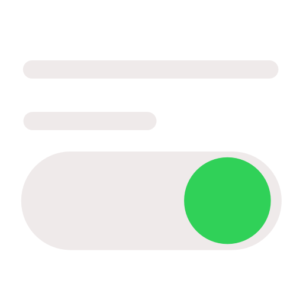
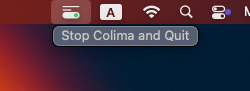
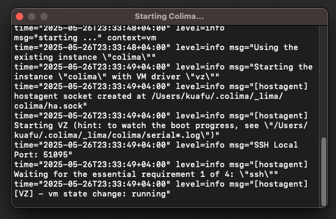

[中文🇨🇳](./README_zh.md "")

#  ColimaToggle

A minimalist macOS menu bar app to manage [Colima](https://github.com/abiosoft/colima).  
Built because I kept forgetting to turn it off.

---

## Why I Made This

I use Colima daily as a Docker alternative, but I often forgot to stop it after work —  
wasting memory and running background VMs I no longer needed.

**ColimaToggle** solves this problem by sitting in the menu bar, reminding me that Colima is running — and letting me shut it down with a single click.

---

## Features

- **Menu Bar Only** – No Dock icon, no ⌘+Tab switcher
- **Auto-start Colima** – Starts on app launch if not running
- **Black log window** – Shows `colima start` or `stop` logs live
- **Built with Swift + AppKit**
- **Works on macOS 13+**

---

## Screenshots

### Menu Bar Control


---

### Terminal Output Window


---

## Installation

1. [Download the latest release](https://github.com/XFSeven7/ColimaToggle/releases)
2. Move `ColimaToggle.app` to your `/Applications`
3. Launch it — you’ll see the icon in the menu bar
4. Click to stop Colima and quit

---

## Requirements

- [Colima](https://github.com/abiosoft/colima) must be installed
- The app uses:

  ```bash
  /bin/zsh -l -c "colima start"
  /bin/zsh -l -c "colima stop"
