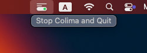

[English 🇺🇸](./README.md "")

#  ColimaToggle

一个极简的 macOS 菜单栏应用，用于一键启动和关闭 [Colima](https://github.com/abiosoft/colima)。  
我开发这个工具，是因为我经常忘记关闭它。

---

## 为什么我要做这个应用

我每天都用 Colima 来替代 Docker Desktop，轻量又高效。  
但工作结束后经常忘记关闭它 ——  
浪费内存、后台虚拟机持续运行、电池掉得飞快。

**ColimaToggle** 解决这个问题，驻留在菜单栏中，提醒我开了这个服务，一次点击就能关闭 Colima。

---

## 功能特色

- **仅菜单栏驻留** – 不出现在 Dock，不出现在 ⌘+Tab 应用切换器中
- **启动自动运行 Colima** – 如果未运行，将在启动时自动开启
- **黑色终端窗口** – 实时显示 `colima start` 或 `stop` 的日志
- **使用 Swift + AppKit 编写**
- **支持 macOS 13 及以上**

---

## 截图展示

### 菜单栏控制


---

### 日志输出窗口


---

## 安装方式

1. [下载最新版本](https://github.com/XFSeven7/ColimaToggle/releases)
2. 将 `ColimaToggle.app` 拖动到你的 `/Applications` 文件夹中
3. 启动应用，你将看到菜单栏图标
4. 点击菜单即可一键停止 Colima 并退出程序

---

## 使用要求

- 系统中已安装 [Colima](https://github.com/abiosoft/colima)
- 应用内部使用以下命令启动和关闭：

  ```bash
  /bin/zsh -l -c "colima start"
  /bin/zsh -l -c "colima stop"
